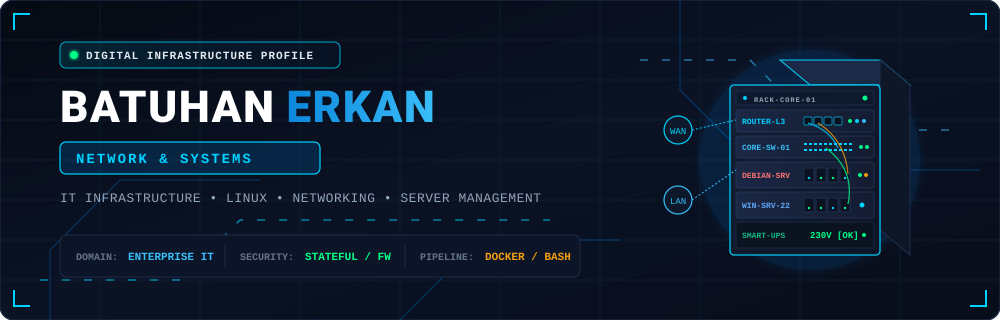
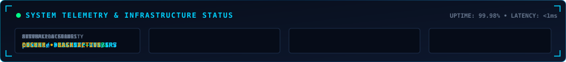
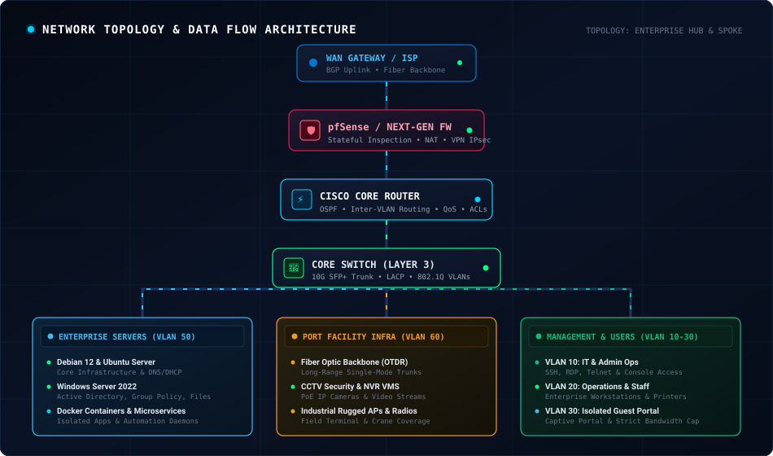
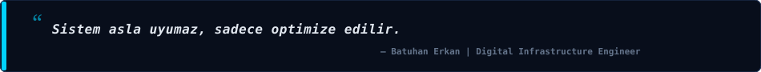

  

  

  <a href="#-whoami"><b>[ 👨‍💻 whoami ]</b></a>&nbsp;&nbsp;•&nbsp;&nbsp;
  <a href="#-network--systems"><b>[ 🌐 Network &amp; Systems ]</b></a>&nbsp;&nbsp;•&nbsp;&nbsp;
  <a href="#%EF%B8%8F-real-world-infrastructure"><b>[ 🏗️ Infrastructure ]</b></a>&nbsp;&nbsp;•&nbsp;&nbsp;
  <a href="#-technical-stack--matrix"><b>[ 🛠️ Tech Stack ]</b></a>&nbsp;&nbsp;•&nbsp;&nbsp;
  <a href="#-currently-exploring"><b>[ 🔭 Exploring ]</b></a>&nbsp;&nbsp;•&nbsp;&nbsp;
  <a href="#-project-showcase"><b>[ 💎 Projects ]</b></a>&nbsp;&nbsp;•&nbsp;&nbsp;
  <a href="#-github-ecosystem"><b>[ 📊 Ecosystem ]</b></a>&nbsp;&nbsp;•&nbsp;&nbsp;
  <a href="#-communication-uplink"><b>[ 📡 Connect ]</b></a>

  

---

## 👨‍💻 `whoami --verbose`

  

<table width="100%">
  <tr>
    <td width="50%" valign="top">
      <h3>🛰️ Profil Özeti &amp; Saha Odağı</h3>
      <ul>
        <li>🎓 <b>Eğitim:</b> Bilecik Şeyh Edebali Üniversitesi — <i>İnternet ve Ağ Teknolojileri</i></li>
        <li>🚢 <b>Mevcut Görev:</b> Liman Tesisinde IT Stajyeri (Fiber Omurga, CCTV, Kurumsal LAN)</li>
        <li>🎯 <b>Ana Odak:</b> Ağ Mimarisi, Güvenlik Duvarı Sistemleri, Sunucu Optimizasyonu ve Linux Altyapıları</li>
        <li>📍 <b>Lokasyon:</b> Türkiye / Kocaeli</li>
      </ul>
    </td>
    <td width="50%" valign="top">
      <h3>⚙️ Altyapı İlkeleri &amp; Felsefe</h3>
      <ul>
        <li>🛡️ <b>Sıfır Güven (Zero Trust):</b> Segmentasyon, sıkı erişim kontrolleri ve izleme.</li>
        <li>⚡ <b>Yüksek Erişilebilirlik (HA):</b> Yedekli hatlar, kesintisiz güç ve servis sürekliliği.</li>
        <li>🔄 <b>Otomasyon:</b> Rutin süreçlerin Bash/Python betikleriyle otomatikleştirilmesi.</li>
        <li>💬 <b>Motto:</b> <i>"Sistem asla uyumaz, sadece optimize edilir."</i></li>
      </ul>
    </td>
  </tr>
</table>

---

## 🌐 Network &amp; Systems

Ağ ve sistem altyapısı, tüm dijital mimarinin temel omurgasını oluşturur. Yönlendirme, anahtarlama, paket filtreleme, güvenlik politikaları ve sunucu servislerinin güvenli, hızlı ve kesintisiz çalışması öncelikli çalışma alanımdır.

  

<table width="100%">
  <thead>
    <tr>
      <th width="33%" align="center">📡 <b>NETWORKING</b></th>
      <th width="33%" align="center">🖥️ <b>SYSTEMS</b></th>
      <th width="34%" align="center">🛡️ <b>INFRASTRUCTURE &amp; SECURITY</b></th>
    </tr>
  </thead>
  <tbody>
    <tr>
      <td valign="top">
        <ul>
          <li><b>Routing &amp; Switching:</b> Cisco IOS, VLAN (802.1Q), Inter-VLAN Routing</li>
          <li><b>Protokoller:</b> TCP/IP, OSPF, DHCP, DNS, NAT/PAT, ARP, ICMP</li>
          <li><b>Trafik &amp; Analiz:</b> Wireshark, Bant Genişliği Yönetimi, QoS</li>
          <li><b>Sorun Giderme:</b> Paket kaybı, döngü engelleme (STP), link teşhisi</li>
        </ul>
      </td>
      <td valign="top">
        <ul>
          <li><b>Linux Dağıtımları:</b> Debian, Ubuntu Server, Bash CLI yönetimi</li>
          <li><b>Windows Server:</b> Windows Server 2022, Active Directory, GPO</li>
          <li><b>Sistem Servisleri:</b> SSH, DNS/DHCP Sunucuları, Web Sunucuları</li>
          <li><b>Yedekleme &amp; Depolama:</b> RAID yapıları, veri yedekleme, log analizi</li>
        </ul>
      </td>
      <td valign="top">
        <ul>
          <li><b>Güvenlik Duvarı:</b> pfSense, Stateful Inspection, Kural Zincirleri</li>
          <li><b>VPN Çözümleri:</b> IPsec, OpenVPN, Güvenli Uzak Erişim</li>
          <li><b>Konteyner:</b> Docker, Docker Compose, Servis İzolasyonu</li>
          <li><b>Fiziksel Güvenlik:</b> NVR/VMS, PoE Altyapısı, CCTV Kameralar</li>
        </ul>
      </td>
    </tr>
  </tbody>
</table>

---

## 🏗️ Real World Infrastructure

Liman tesisindeki saha operasyonları ve kurumsal BT ortamında edinilen pratik altyapı tecrübeleri:

<table>
  <tr>
    <td width="25%" align="center" valign="top">
      <h4>🧵 Fiber Optik Altyapı</h4>
      

        • Single-mode omurga hatları 
        • Fiber patch panel sonlandırma 
        • OTDR ve VFL ile hat süreklilik testleri 
        • Yapısal kablolama organizasyonu
      

    </td>
    <td width="25%" align="center" valign="top">
      <h4>📹 CCTV &amp; Güvenlik</h4>
      

        • Endüstriyel IP kamera montaj ve konfigürasyonu 
        • PoE anahtar (switch) yönetimi 
        • NVR ve VMS sunucu kayıt operasyonları 
        • Video stream bant genişliği optimizasyonu
      

    </td>
    <td width="25%" align="center" valign="top">
      <h4>🏢 Kurumsal Ağ &amp; Saha</h4>
      

        • Erişim Noktası (Access Point) kurulumları 
        • VLAN segmentasyonu ve port güvenliği 
        • Saha terminal ve el terminalleri desteği 
        • Donanım arıza tespiti ve kablo testleri
      

    </td>
    <td width="25%" align="center" valign="top">
      <h4>🖥️ Sistem &amp; Kullanıcı</h4>
      

        • Windows Server ortamında kullanıcı yönetimi 
        • Kurumsal istemci (PC/laptop) kurulumları 
        • Yazıcı ve ağ cihazları paylaşımları 
        • Düzenli veri yedekleme operasyonları
      

    </td>
  </tr>
</table>

---

## 🛠️ Technical Ecosystem &amp; Technology Matrix

| **Katman / Domain** | **Uzmanlık &amp; Odak Alanı** | **Teknolojiler &amp; Standartlar** |
| :--- | :--- | :--- |
| **🌐 Networking** | Yönlendirme, Anahtarlama, Güvenlik Duvarı, Ağ Teşhisi | `Cisco IOS` `pfSense` `TCP/IP` `VLAN (802.1Q)` `OSPF` `DHCP/DNS` `NAT` |
| **🖥️ Systems** | Kurumsal İşletim Sistemleri, Sunucu Yönetimi | `Debian` `Ubuntu Server` `Linux Kernel/CLI` `Windows Server 2022` |
| **🏗️ Infrastructure** | Fiziksel ve Mantıksal BT Altyapısı, Konteyner | `Fiber Optics` `CCTV / IP Cameras` `PoE` `Docker` `Docker Compose` |
| **⚡ Automation** | Betikleme, Görev Otomasyonu, CLI Araçları | `Bash Scripting` `Python` `PowerShell` |
| **💻 Development** | Sistem Araçları, Arka Uç ve Gömülü Sistemler | `C#` `.NET` `JavaScript` `Arduino` |
| **🗄️ Databases** | Veri Depolama ve Veritabanı Yönetimi | `PostgreSQL` `MySQL` `SQLite` `MongoDB` |
| **🔧 Tools &amp; Ops** | Versiyon Kontrolü, Ağ Araçları, Tasarım | `Git` `GitHub` `Postman` `Wireshark` `Figma` `Photoshop` |

 

### 🧰 Teknoloji Rozetleri &amp; Araç Seti

  <b>Sistemler &amp; Altyapı</b> 
  

  <b>Otomasyon &amp; Geliştirme</b> 
  

  <b>Veritabanları &amp; Operasyonel Araçlar</b> 
  

---

## 🔭 Currently Exploring

Şu anda aktif olarak araştırdığım, laboratuvar ortamında test ettiğim ve geliştirdiğim alanlar:

<table>
  <tr>
    <td width="50%" valign="top">
      <h4>🐳 Docker &amp; Konteyner Mimarisi</h4>
      
Servislerin birbirinden izole olarak çalıştırılması, homelab ortamında Docker Compose ile otomatik servis dağıtımı ve hafif altyapı yönetimi.

    </td>
    <td width="50%" valign="top">
      <h4>🐍 Python &amp; Bash ile Ağ Otomasyonu</h4>
      
Ağ cihazlarının konfigürasyon yedeklerinin otomatik alınması, periyodik ping/port taramaları ve log analiz betikleri geliştirme.

    </td>
  </tr>
  <tr>
    <td width="50%" valign="top">
      <h4>🏛️ Windows Server 2022 &amp; Debian Hardening</h4>
      
Active Directory kullanıcı ve grup politikaları (GPO), DNS/DHCP sunucu rolleri ile Debian tabanlı sunucularda güvenlik sıkılaştırması (hardening).

    </td>
    <td width="50%" valign="top">
      <h4>🛡️ pfSense &amp; Yeni Nesil Güvenlik Duvarı Politikaları</h4>
      
Gelişmiş kural zincirleri, Snort/Suricata tabanlı IDS/IPS entegrasyonları, VLAN tabanlı trafik filtreleme ve güvenli tünelleme senaryoları.

    </td>
  </tr>
</table>

---

## 💎 Project Showcase

Ağ ve sistem altyapısı odaklı laboratuvar, otomasyon ve geliştirme çalışmaları:

<table>
  <tr>
    <td width="50%" valign="top">
      <h3>🌐 <a href="https://github.com/iWixsy/iWixsy">iWixsy / Digital Infrastructure Profile</a></h3>
      
Kurumsal BT altyapısı, ağ topolojisi ve sistem yönetimi kimliğini yansıtan özel tasarım GitHub profil mimarisi.

      

        <code>Markdown</code> • <code>Custom SVG</code> • <code>Network Architecture</code>
      

      
<a href="https://github.com/iWixsy/iWixsy"><b>➜ Repoyu Görüntüle</b></a>

    </td>
    <td width="50%" valign="top">
      <h3>⚡ <a href="https://github.com/iWixsy">Network Automation &amp; Diagnostics Lab</a></h3>
      
Ağ cihazları için konfigürasyon yedekleme, IP/subnet taramaları ve bağlantı süreklilik teşhisini sağlayan otomasyon scriptleri.

      

        <code>Python</code> • <code>Bash</code> • <code>Cisco IOS</code> • <code>Linux</code>
      

      
<a href="https://github.com/iWixsy"><b>➜ Çalışmaları İncele</b></a>

    </td>
  </tr>
  <tr>
    <td width="50%" valign="top">
      <h3>🐳 <a href="https://github.com/iWixsy">Containerized Homelab &amp; Server Infrastructure</a></h3>
      
Debian ve Linux üzerinde Docker tabanlı mikroservis yapılandırması, Nginx reverse proxy ve yerel ağ servis izolasyonu.

      

        <code>Docker</code> • <code>Debian</code> • <code>Nginx</code> • <code>Networking</code>
      

      
<a href="https://github.com/iWixsy"><b>➜ İncele</b></a>

    </td>
    <td width="50%" valign="top">
      <h3>🛠️ <a href="https://github.com/iWixsy">System Utilities &amp; Embedded Controllers</a></h3>
      
Sistem telemetrisi, donanım sensör takibi ve yardımcı araçlar için geliştirilen masaüstü ve gömülü sistem uygulamaları.

      

        <code>C#</code> • <code>.NET</code> • <code>Arduino</code> • <code>Python</code>
      

      
<a href="https://github.com/iWixsy"><b>➜ İncele</b></a>

    </td>
  </tr>
</table>

---

## 📊 GitHub Ecosystem

<table>
  <tr>
    <td align="center" width="50%" style="border:none;">
      
    </td>
    <td align="center" width="50%" style="border:none;">
      
    </td>
  </tr>
</table>

 

---

## 📡 Communication Uplink • `connect()`

Ağ, sistem ve altyapı konularında fikir alışverişi yapmak veya iletişime geçmek için:

&nbsp;
&nbsp;
&nbsp;

  

| **Kanal** | **Açıklama** | **Bağlantı** |
| :--- | :--- | :--- |
| 💼 **LinkedIn** | Profesyonel ağ ve kariyer bağlantıları | [linkedin.com/in/batuhan-erkan](https://www.linkedin.com/in/batuhan-erkan-913481355/) |
| 📧 **E-Posta** | Doğrudan iletişim ve teknik yazışmalar | [batuhan.iletisimm2@gmail.com](mailto:batuhan.iletisimm2@gmail.com) |
| 🐙 **GitHub** | Altyapı, otomasyon ve laboratuvar projeleri | [github.com/iWixsy](https://github.com/iWixsy) |
| 📸 **Instagram** | Kişisel profil ve günlük paylaşımlar | [instagram.com/batuhan._.erkan](https://www.instagram.com/batuhan._.erkan/) |

 

  

  

