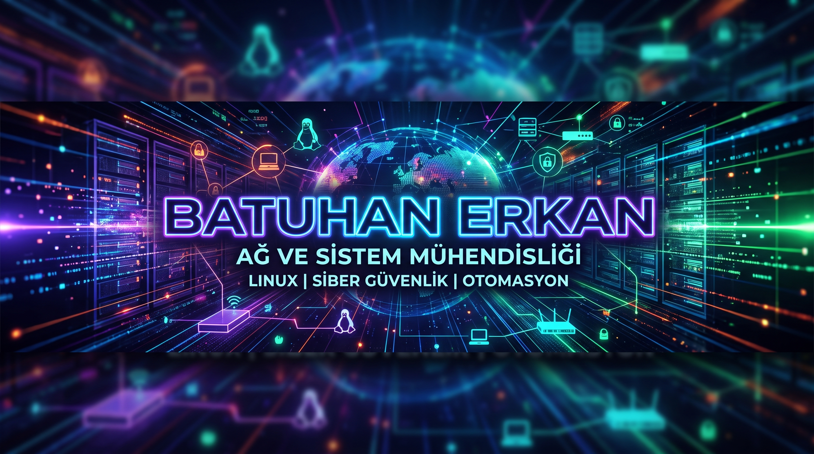

  

  

<h3 align="center">İnternet ve Ağ Teknolojileri Öğrencisi & IT Meraklısı</h3>

  

---

## 👨‍💻 Hakkımda

Bilecik Şeyh Edebali Üniversitesi, **İnternet ve Ağ Teknolojileri** bölümünde öğrenim görüyorum. Kariyerimi ağ ve sistem altyapıları, sunucu yönetimi ve modern yazılım teknolojileri üzerine inşa ediyorum.

*   🎓 **Eğitim:** İnternet ve Ağ Teknolojileri (Ön Lisans)
*   🚢 **Deneyim:** Bir liman tesisinde Bilgi Teknolojileri Stajyeri olarak kurumsal IT altyapısı, ağ bakımı (fiber/CCTV), donanım envanteri ve sistem yapılandırmaları üzerine çalışıyorum.
*   🌐 **Ağ & Sistem:** Cisco ağ topolojileri (VLAN, STP, HSRP, ACL, NAT, IPv6), Linux dağıtımları ve Windows Server mimarileri üzerinde pratik yapıyorum.
*   💻 **Yazılım & Veritabanı:** ASP.NET Core Web API, WinUI 3, PostgreSQL ve SQL Server kullanarak uygulama geliştirme süreçlerine aşinayım.
*   🔌 **Donanım:** Arduino ve mikrokontrolör devreleri ile IoT ve elektronik donanım projeleriyle ilgileniyorum.

---

## 🛠️ Yetenekler & Teknolojiler

### Ağ & Sistem Yönetimi

  
  
  
  
  
  

### Yazılım & Veritabanı

  
  
  
  
  

### Web & Otomasyon & Araçlar

  
  
  
  
  
  

---

## 📈 GitHub İstatistiklerim

  
  

  

---

## 🚀 Öne Çıkan Projeler & Çalışmalar

*   **Kişisel Portfolyo Web Sitesi:** HTML, CSS ve JavaScript teknolojilerini kullanarak tasarladığım kişisel web sitem.
*   **Ağ Topolojisi ve Simülasyon Uygulamaları:** Kurumsal ağ gereksinimlerini simüle eden routing, switching ve güvenlik duvarı yapılandırmaları.
*   **Veritabanı Yönetimi & Sorgulama:** SQL Server üzerinde performanslı sorgular oluşturma ve veri bütünlüğü sağlama projeleri.

---

## 📫 İletişim & Bağlantılar

  
  
  

